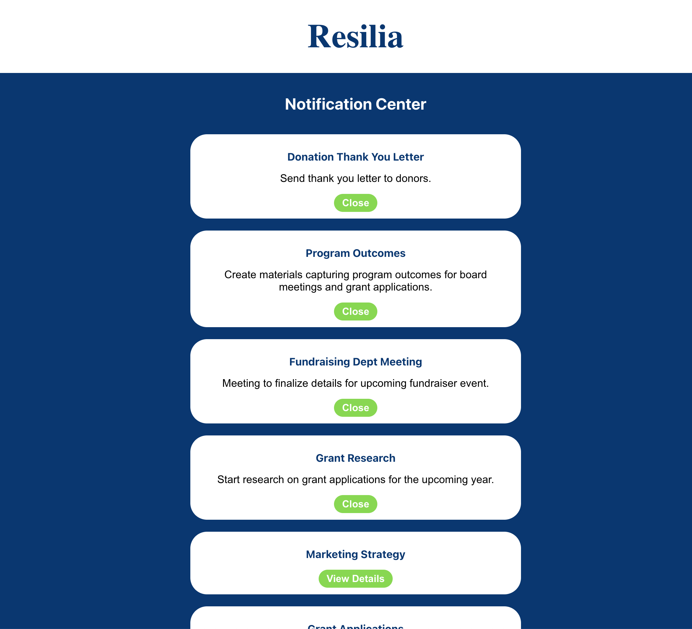

# Resilia Take Home Exercise

## Description
This repo contains my fullstack application for Resilia's take home exercise.

The tech stack consists of the following:
- React frontend with CSS
- Rails backend
- PostgreSQL database

The React frontend uses the `useEffect` hook to fetch the notifications data from the Rails API `/notifications` route.

If the fetch is successful, the notifications data will be stored in the `App.js` component `state` and in `localStorage` as a means of persistent store.

If the fetch fails, the notifications data from `localStorage` will be used to set the `App.js` component `state`.

The `state` is then passed down to the `NotificationsContainer` which handles rendering a `Notification` component for each notification.
